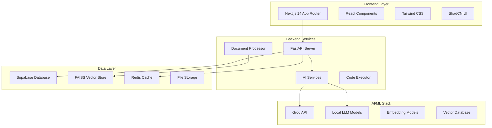

# Engunity AI - Next Generation AI Platform

[](https://opensource.org/licenses/MIT)
[](https://www.typescriptlang.org/)
[](https://nextjs.org/)
[](https://fastapi.tiangolo.com/)
[](https://supabase.com/)

> **Empowering intelligence through AI-driven solutions**

Engunity AI is a comprehensive, enterprise-grade artificial intelligence platform that combines cutting-edge machine learning capabilities with intuitive user experiences. Built for developers, researchers, and businesses, it offers a unified ecosystem for AI-powered document processing, code generation, data analysis, and intelligent research assistance.

## ✨ Key Features

### 🤖 **AI-Powered Chat Interface**
- Advanced conversational AI with context awareness
- Multi-modal chat supporting text, code, and documents
- Real-time streaming responses with typing indicators
- Conversation history and thread management

### 📄 **Intelligent Document Processing**
- Support for PDF, DOCX, TXT, and various document formats
- Advanced text extraction and preprocessing
- Vector-based semantic search and retrieval
- Interactive Q&A with document context awareness

### 💻 **Code Generation & Analysis**
- Multi-language code generation (Python, JavaScript, TypeScript, Rust, Go)
- Intelligent code completion and suggestions
- Real-time code execution in secure sandboxed environments
- Code review and optimization recommendations

### 📊 **Data Analysis & Visualization**
- Automated data processing and statistical analysis
- Interactive charts and visualization generation
- Support for CSV, Excel, JSON, and database connections
- Machine learning model training and evaluation

### 🔬 **Research & Literature Tools**
- Academic paper analysis and summarization
- Citation management and reference formatting
- Literature gap analysis and research recommendations
- Automated research paper generation

### 🌐 **Web3 & Blockchain Integration**
- Decentralized AI model marketplace
- Smart contract auditing and analysis
- Blockchain-based credential verification
- IPFS storage for distributed content

## 🏗️ Architecture Overview



## 🚀 Quick Start

### Prerequisites

Ensure you have the following installed:
- **Node.js** 18.17+ 
- **Python** 3.11+
- **Docker** & **Docker Compose**
- **Git**

### 1. Clone the Repository

```bash
git clone https://github.com/your-org/engunity-ai.git
cd engunity-ai
```

### 2. Environment Setup

```bash
# Copy environment templates
cp frontend/.env.example frontend/.env.local
cp backend/.env.example backend/.env

# Install dependencies
npm install
cd frontend && npm install && cd ..
cd backend && pip install -r requirements.txt && cd ..
```

### 3. Configure Environment Variables

**Frontend (frontend/.env.local):**
```env
NEXT_PUBLIC_SUPABASE_URL=your_supabase_url
NEXT_PUBLIC_SUPABASE_ANON_KEY=your_supabase_anon_key
NEXT_PUBLIC_API_URL=http://localhost:8000
```

**Backend (backend/.env):**
```env
SUPABASE_URL=your_supabase_url
SUPABASE_SERVICE_KEY=your_supabase_service_key
GROQ_API_KEY=your_groq_api_key
DATABASE_URL=your_database_url
REDIS_URL=redis://localhost:6379
```

### 4. Start Development Environment

```bash
# Start all services with Docker
docker-compose up -d

# Or start individual services
npm run dev:frontend     # Frontend on http://localhost:3000
npm run dev:backend      # Backend on http://localhost:8000
```

### 5. Initialize Database

```bash
cd backend
python scripts/setup_database.py
python scripts/seed_data.py
```

## 📁 Project Structure

```
engunity-ai/
├── 🎨 frontend/                 # Next.js 14 Frontend Application
│   ├── src/
│   │   ├── app/                 # App Router Pages
│   │   ├── components/          # Reusable React Components
│   │   ├── lib/                 # Utility Libraries & Configs
│   │   ├── hooks/               # Custom React Hooks
│   │   ├── store/               # Zustand State Management
│   │   └── types/               # TypeScript Definitions
│   ├── public/                  # Static Assets
│   └── tests/                   # Frontend Tests
│
├── ⚡ backend/                  # FastAPI Backend Services
│   ├── app/
│   │   ├── api/                 # API Endpoints
│   │   ├── core/                # Core Configurations
│   │   ├── models/              # Database Models
│   │   ├── services/            # Business Logic
│   │   ├── agents/              # LangChain AI Agents
│   │   └── utils/               # Utility Functions
│   ├── vector_store/            # FAISS Vector Database
│   ├── migrations/              # Database Migrations
│   └── tests/                   # Backend Tests
│
├── ⛓️ blockchain/              # Blockchain Components
│   ├── contracts/               # Smart Contracts (Solidity)
│   ├── scripts/                 # Deployment Scripts
│   └── test/                    # Contract Tests
│
├── 🏗️ infrastructure/          # Infrastructure as Code
│   ├── docker/                  # Docker Configurations
│   ├── kubernetes/              # K8s Manifests
│   └── terraform/               # Cloud Infrastructure
│
├── 📚 docs/                    # Documentation
├── 🔧 scripts/                # Development Scripts
└── 📦 data/                   # Data Storage
```

## 🛠️ Technology Stack

### **Frontend**
- **Framework**: Next.js 14 with App Router
- **Language**: TypeScript 5.0+
- **Styling**: Tailwind CSS + ShadCN UI
- **State**: Zustand + React Query
- **Animation**: Framer Motion
- **Forms**: React Hook Form + Zod

### **Backend**
- **Framework**: FastAPI (Python 3.11+)
- **Database**: Supabase (PostgreSQL)
- **Vector DB**: FAISS + Chroma
- **Cache**: Redis
- **AI/ML**: Groq API + Local Models
- **Task Queue**: Celery + Redis

### **AI & Machine Learning**
- **LLM Provider**: Groq (Llama 3.1, Mixtral)
- **Local Models**: Phi-3, CodeLlama
- **Embeddings**: OpenAI, Sentence Transformers
- **Vector Search**: FAISS, Pinecone
- **Agents**: LangChain, CrewAI

### **Blockchain**
- **Platform**: Ethereum, Polygon
- **Framework**: Hardhat, Ethers.js
- **Storage**: IPFS, Arweave
- **Wallets**: MetaMask, WalletConnect

### **DevOps & Infrastructure**
- **Containerization**: Docker + Docker Compose
- **Orchestration**: Kubernetes (future)
- **CI/CD**: GitHub Actions
- **Deployment**: Vercel (Frontend), Railway (Backend)
- **Monitoring**: Prometheus + Grafana

## 🎯 Core Modules

### 1. **Authentication & User Management**
- Secure JWT-based authentication
- OAuth integration (Google, GitHub)
- Role-based access control (RBAC)
- User profile and preference management

### 2. **AI Chat System**
- Multi-model AI conversations
- Context-aware responses
- Conversation threading and history
- Real-time WebSocket connections

### 3. **Document Intelligence**
- File upload and processing pipeline
- OCR and text extraction
- Vector embedding and indexing
- Semantic search and retrieval

### 4. **Code Assistant**
- Multi-language code generation
- Syntax highlighting and completion
- Secure code execution sandbox
- Version control integration

### 5. **Data Analytics**
- Automated data processing
- Statistical analysis and ML modeling
- Interactive visualization dashboard
- Export and sharing capabilities

### 6. **Research Tools**
- Academic paper processing
- Citation management
- Literature review automation
- Research workflow optimization

## 📊 Performance & Scalability

- **Response Time**: < 200ms for API endpoints
- **Throughput**: 1000+ concurrent users
- **Uptime**: 99.9% SLA target
- **Scalability**: Horizontal scaling ready
- **Caching**: Multi-layer caching strategy
- **CDN**: Global content delivery

## 🔒 Security Features

- **Authentication**: JWT + OAuth 2.0
- **Authorization**: RBAC with fine-grained permissions  
- **Data Protection**: End-to-end encryption
- **API Security**: Rate limiting, CORS, HTTPS
- **Code Execution**: Sandboxed environments
- **Compliance**: GDPR, SOC 2 ready

## 🧪 Testing Strategy

### **Frontend Testing**
```bash
npm run test           # Unit tests (Jest)
npm run test:e2e      # E2E tests (Playwright)
npm run test:coverage # Coverage report
```

### **Backend Testing**
```bash
pytest                # Unit tests
pytest --cov         # Coverage report  
pytest tests/integration/  # Integration tests
```

### **Performance Testing**
```bash
npm run test:performance  # Lighthouse CI
python scripts/load_test.py  # Backend load testing
```

## 📈 Monitoring & Analytics

- **Application Performance**: New Relic, DataDog
- **Error Tracking**: Sentry
- **User Analytics**: PostHog, Google Analytics
- **Infrastructure**: Prometheus + Grafana
- **Logs**: ELK Stack (Elasticsearch, Logstash, Kibana)

## 🚀 Deployment

### **Development**
```bash
docker-compose up -d
```

### **Production**
```bash
# Frontend (Vercel)
vercel deploy

# Backend (Railway)
railway deploy

# Infrastructure (Terraform)
terraform apply
```

## 🤝 Contributing

We welcome contributions! Please see our [Contributing Guidelines](CONTRIBUTING.md) for details.

### Development Workflow
1. Fork the repository
2. Create a feature branch (`git checkout -b feature/amazing-feature`)
3. Make your changes
4. Run tests (`npm run test`)
5. Commit changes (`git commit -m 'Add amazing feature'`)
6. Push to branch (`git push origin feature/amazing-feature`)
7. Open a Pull Request

### Code Style
- **Frontend**: ESLint + Prettier (Airbnb config)
- **Backend**: Black + isort + mypy
- **Commits**: Conventional Commits format

## 📄 License

This project is licensed under the MIT License - see the [LICENSE](LICENSE) file for details.

## 🆘 Support

- **Documentation**: [docs.engunity.ai](https://docs.engunity.ai)
- **Issues**: [GitHub Issues](https://github.com/your-org/engunity-ai/issues)
- **Discussions**: [GitHub Discussions](https://github.com/your-org/engunity-ai/discussions)
- **Email**: support@engunity.ai
- **Discord**: [Join our community](https://discord.gg/engunity-ai)

## 🌟 Roadmap

### **Q1 2025**
- [ ] Mobile app development (React Native)
- [ ] Advanced AI model fine-tuning
- [ ] Enterprise SSO integration
- [ ] API rate limiting enhancements

### **Q2 2025** 
- [ ] Kubernetes orchestration
- [ ] Multi-cloud deployment
- [ ] Advanced analytics dashboard
- [ ] Plugin ecosystem

### **Q3 2025**
- [ ] Voice interface integration
- [ ] Real-time collaboration features
- [ ] Advanced blockchain features
- [ ] AI model marketplace

---

<div align="center">
  <p>
    <strong>Built with ❤️ by the Engunity AI Team</strong>
  </p>
  <p>
    <a href="https://engunity.ai">Website</a> •
    <a href="https://docs.engunity.ai">Documentation</a> •
    <a href="https://blog.engunity.ai">Blog</a> •
    <a href="https://twitter.com/engunity_ai">Twitter</a>
  </p>
</div>