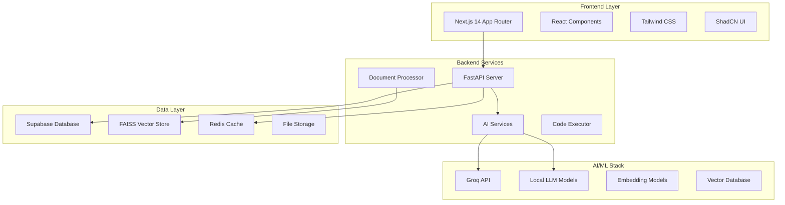

# Engunity AI - Next Generation AI Platform

[](https://opensource.org/licenses/MIT)
[](https://www.typescriptlang.org/)
[](https://nextjs.org/)
[](https://fastapi.tiangolo.com/)
[](https://supabase.com/)

> **Empowering intelligence through AI-driven solutions**

Engunity AI is a comprehensive, enterprise-grade artificial intelligence platform that combines cutting-edge machine learning capabilities with intuitive user experiences. Built for developers, researchers, and businesses, it offers a unified ecosystem for AI-powered document processing, code generation, data analysis, and intelligent research assistance.

## ✨ Key Features

### 🤖 **AI-Powered Chat Interface**
- Advanced conversational AI with context awareness
- Multi-modal chat supporting text, code, and documents
- Real-time streaming responses with typing indicators
- Conversation history and thread management

### 📄 **Intelligent Document Processing**
- Support for PDF, DOCX, TXT, and various document formats
- Advanced text extraction and preprocessing
- Vector-based semantic search and retrieval
- Interactive Q&A with document context awareness

### 💻 **Code Generation & Analysis**
- Multi-language code generation (Python, JavaScript, TypeScript, Rust, Go)
- Intelligent code completion and suggestions
- Real-time code execution in secure sandboxed environments
- Code review and optimization recommendations

### 📊 **Data Analysis & Visualization**
- Automated data processing and statistical analysis
- Interactive charts and visualization generation
- Support for CSV, Excel, JSON, and database connections
- Machine learning model training and evaluation

### 🔬 **Research & Literature Tools**
- Academic paper analysis and summarization
- Citation management and reference formatting
- Literature gap analysis and research recommendations
- Automated research paper generation

### 🌐 **Web3 & Blockchain Integration**
- Decentralized AI model marketplace
- Smart contract auditing and analysis
- Blockchain-based credential verification
- IPFS storage for distributed content

## 🏗️ Architecture Overview



## 🚀 Quick Start

### Prerequisites

Ensure you have the following installed:
- **Node.js** 18.17+ 
- **Python** 3.11+
- **Docker** & **Docker Compose**
- **Git**

### 1. Clone the Repository

```bash
git clone https://github.com/your-org/engunity-ai.git
cd engunity-ai
```

### 2. Environment Setup

```bash
# Copy environment templates
cp frontend/.env.example frontend/.env.local
cp backend/.env.example backend/.env

# Install dependencies
npm install
cd frontend && npm install && cd ..
cd backend && pip install -r requirements.txt && cd ..
```

### 3. Configure Environment Variables

**Frontend (frontend/.env.local):**
```env
NEXT_PUBLIC_SUPABASE_URL=your_supabase_url
NEXT_PUBLIC_SUPABASE_ANON_KEY=your_supabase_anon_key
NEXT_PUBLIC_API_URL=http://localhost:8000
```

**Backend (backend/.env):**
```env
SUPABASE_URL=your_supabase_url
SUPABASE_SERVICE_KEY=your_supabase_service_key
GROQ_API_KEY=your_groq_api_key
DATABASE_URL=your_database_url
REDIS_URL=redis://localhost:6379
```

### 4. Start Development Environment

```bash
# Start all services with Docker
docker-compose up -d

# Or start individual services
npm run dev:frontend     # Frontend on http://localhost:3000
npm run dev:backend      # Backend on http://localhost:8000
```

### 5. Initialize Database

```bash
cd backend
python scripts/setup_database.py
python scripts/seed_data.py
```

## 📁 Complete Project Structure

```
engunity-ai/
├── 📄 Root Configuration Files
│   ├── CHANGELOG.md                    # Version history and changes
│   ├── CLAUDE.md                       # Claude AI project instructions
│   ├── CODE_OF_CONDUCT.md             # Community guidelines
│   ├── CONTRIBUTING.md                 # Contribution guidelines
│   ├── FRONTEND.md                     # Frontend documentation
│   ├── LICENSE                         # MIT license
│   ├── Makefile                        # Build automation
│   ├── README.md                       # Project overview (this file)
│   ├── SECURITY.md                     # Security policies
│   ├── SETTINGS_INSTALLATION.md       # Settings setup guide
│   ├── docker-compose.yml              # Development environment
│   ├── docker-compose.prod.yml         # Production environment
│   ├── docker-compose.test.yml         # Testing environment
│   ├── firebase.json                   # Firebase configuration
│   ├── index.html                      # Root HTML file
│   ├── lerna.json                      # Lerna monorepo config
│   ├── package-lock.json               # Root dependencies lock
│   ├── storage.rules                   # Storage access rules
│   ├── check-documents.js              # Document verification script
│   ├── setup-settings-db.sql           # Settings database setup
│   ├── supabase-migration.sql          # Database migration
│   ├── supabase-setup.sql              # Supabase initial setup
│   └── user_settings_migration.sql     # User settings migration
│
├── 🎨 frontend/                        # Next.js 14 Frontend Application
│   ├── 📁 Configuration
│   │   ├── next.config.js              # Next.js configuration
│   │   ├── tailwind.config.js          # Tailwind CSS config
│   │   ├── postcss.config.js           # PostCSS configuration
│   │   ├── tsconfig.json               # TypeScript configuration
│   │   ├── package.json                # Frontend dependencies
│   │   ├── package-lock.json           # Dependencies lock file
│   │   ├── next-env.d.ts               # Next.js type definitions
│   │   ├── middleware.ts               # Next.js middleware
│   │   └── vercel.json                 # Vercel deployment config
│   │
│   ├── 📁 Source Code (src/)
│   │   ├── 🏠 app/                     # Next.js App Router
│   │   │   ├── layout.tsx              # Root layout component
│   │   │   ├── page.tsx                # Home page
│   │   │   ├── globals.css             # Global styles
│   │   │   ├── loading.tsx             # Loading UI
│   │   │   ├── error.tsx               # Error boundary
│   │   │   ├── not-found.tsx           # 404 page
│   │   │   │
│   │   │   ├── 🔐 auth/               # Authentication pages
│   │   │   │   ├── layout.tsx          # Auth layout
│   │   │   │   ├── login/page.tsx      # Login page
│   │   │   │   ├── register/page.tsx   # Registration page
│   │   │   │   ├── forgot-password/page.tsx # Password reset
│   │   │   │   ├── verify-email/page.tsx    # Email verification
│   │   │   │   └── callback/page.tsx   # OAuth callback
│   │   │   │
│   │   │   ├── 🏪 dashboard/          # Main application dashboard
│   │   │   │   ├── layout.tsx          # Dashboard layout
│   │   │   │   ├── page.tsx            # Dashboard home
│   │   │   │   │
│   │   │   │   ├── 📊 analysis/       # Data analysis features
│   │   │   │   │   ├── page.tsx        # Analysis home
│   │   │   │   │   ├── upload/page.tsx # Data upload
│   │   │   │   │   └── [datasetId]/page.tsx # Dataset view
│   │   │   │   │
│   │   │   │   ├── 🔍 audit/          # Blockchain auditing
│   │   │   │   │   ├── page.tsx        # Audit home
│   │   │   │   │   └── [auditId]/      # Audit details
│   │   │   │   │
│   │   │   │   ├── 💬 chat/           # AI chat interface
│   │   │   │   │   ├── page.tsx        # Chat home
│   │   │   │   │   ├── loading.tsx     # Chat loading
│   │   │   │   │   └── [threadId]/     # Chat thread
│   │   │   │   │
│   │   │   │   ├── 💻 code/           # Code generation tools
│   │   │   │   │   ├── page.tsx        # Code home
│   │   │   │   │   ├── debug/page.tsx  # Code debugger
│   │   │   │   │   └── templates/page.tsx # Code templates
│   │   │   │   │
│   │   │   │   ├── 📄 documents/      # Document management
│   │   │   │   │   ├── README.md       # Documents module guide
│   │   │   │   │   ├── page.tsx        # Documents home
│   │   │   │   │   ├── upload/page.tsx # Document upload
│   │   │   │   │   ├── [id]/page.tsx   # Document details
│   │   │   │   │   ├── [id]/qa/page.tsx # Document Q&A
│   │   │   │   │   ├── [id]/viewer/page.tsx # Document viewer
│   │   │   │   │   └── components/     # Document components
│   │   │   │   │       ├── DocumentViewer.tsx
│   │   │   │   │       ├── FileManager.tsx
│   │   │   │   │       └── QAInterface.tsx
│   │   │   │   │
│   │   │   │   ├── 🏪 marketplace/    # AI model marketplace
│   │   │   │   │   ├── page.tsx        # Marketplace home
│   │   │   │   │   ├── browse/page.tsx # Browse models
│   │   │   │   │   └── [modelId]/page.tsx # Model details
│   │   │   │   │
│   │   │   │   ├── 📓 notebook/       # Jupyter-style notebooks
│   │   │   │   │   ├── page.tsx        # Notebook home
│   │   │   │   │   ├── new/page.tsx    # Create notebook
│   │   │   │   │   ├── [notebookId]/page.tsx # Notebook editor
│   │   │   │   │   └── [notebookId]/share/ # Shared notebooks
│   │   │   │   │
│   │   │   │   ├── 📋 projects/       # Project management
│   │   │   │   │   ├── page.tsx        # Projects home
│   │   │   │   │   ├── new/page.tsx    # Create project
│   │   │   │   │   ├── [projectId]/page.tsx # Project details
│   │   │   │   │   └── [projectId]/kanban/ # Kanban board
│   │   │   │   │
│   │   │   │   ├── 🔬 research/       # Research tools
│   │   │   │   │   ├── page.tsx        # Research home
│   │   │   │   │   ├── citations/page.tsx # Citation manager
│   │   │   │   │   ├── literature/page.tsx # Literature review
│   │   │   │   │   └── summarize/page.tsx # Research summarizer
│   │   │   │   │
│   │   │   │   └── ⚙️ settings/       # User settings
│   │   │   │       ├── page.tsx        # Settings home
│   │   │   │       ├── preferences/page.tsx # User preferences
│   │   │   │       ├── api-keys/page.tsx    # API key management
│   │   │   │       ├── billing/page.tsx     # Billing settings
│   │   │   │       └── test-visibility.tsx  # Settings testing
│   │   │   │
│   │   │   ├── 🔧 api/                # API routes
│   │   │   │   ├── 📊 analysis/       # Analysis endpoints
│   │   │   │   │   ├── process/route.ts     # Data processing
│   │   │   │   │   └── visualize/route.ts   # Visualization
│   │   │   │   ├── 🔐 auth/           # Authentication endpoints
│   │   │   │   │   ├── login/route.ts       # Login endpoint
│   │   │   │   │   ├── logout/route.ts      # Logout endpoint
│   │   │   │   │   └── callback/route.ts    # OAuth callback
│   │   │   │   ├── 💬 chat/           # Chat endpoints
│   │   │   │   │   ├── stream/route.ts      # Streaming chat
│   │   │   │   │   └── history/route.ts     # Chat history
│   │   │   │   ├── 💻 code/           # Code endpoints
│   │   │   │   │   ├── execute/route.ts     # Code execution
│   │   │   │   │   └── generate/route.ts    # Code generation
│   │   │   │   ├── 📄 documents/      # Document endpoints
│   │   │   │   │   ├── upload/route.ts      # File upload
│   │   │   │   │   ├── list/route.ts        # List documents
│   │   │   │   │   ├── search/route.ts      # Document search
│   │   │   │   │   ├── process/route.ts     # Document processing
│   │   │   │   │   └── [id]/           # Document-specific endpoints
│   │   │   │   │       ├── route.ts         # Get document
│   │   │   │   │       ├── delete/route.ts  # Delete document
│   │   │   │   │       ├── view/route.ts    # View document
│   │   │   │   │       ├── qa/route.ts      # Q&A endpoint
│   │   │   │   │       ├── metadata/route.ts # Document metadata
│   │   │   │   │       └── presigned-url/route.ts # S3 URLs
│   │   │   │   └── 🪝 webhooks/       # Webhook endpoints
│   │   │   │       ├── stripe/route.ts      # Stripe webhooks
│   │   │   │       └── supabase/route.ts    # Supabase webhooks
│   │   │   │
│   │   │   ├── 🧪 Testing Pages
│   │   │   │   ├── debug-oauth/page.tsx     # OAuth debugging
│   │   │   │   ├── test-auth/page.tsx       # Auth testing
│   │   │   │   ├── test-settings/page.tsx   # Settings testing
│   │   │   │   └── test-upload/page.tsx     # Upload testing
│   │   │
│   │   ├── 🧩 components/             # Reusable React components
│   │   │   ├── SettingsShowcase.tsx   # Settings demo component
│   │   │   ├── 📊 analysis/           # Analysis components
│   │   │   │   ├── ChartRenderer.tsx   # Chart rendering
│   │   │   │   ├── DataTable.tsx       # Data tables
│   │   │   │   ├── ExportOptions.tsx   # Export functionality
│   │   │   │   ├── FilterPanel.tsx     # Data filtering
│   │   │   │   └── StatsSummary.tsx    # Statistics display
│   │   │   ├── 🔐 auth/               # Authentication components
│   │   │   │   ├── AuthGuard.tsx       # Route protection
│   │   │   │   ├── LoginForm.tsx       # Login form
│   │   │   │   ├── RegisterForm.tsx    # Registration form
│   │   │   │   ├── ForgotPasswordForm.tsx # Password reset
│   │   │   │   ├── SocialAuth.tsx      # Social authentication
│   │   │   │   ├── SocialLogin.tsx     # Social login buttons
│   │   │   │   └── UserProfile.tsx     # User profile display
│   │   │   ├── ⛓️ blockchain/         # Blockchain components
│   │   │   │   ├── ContractAuditor.tsx # Smart contract auditing
│   │   │   │   ├── GasEstimator.tsx    # Gas fee estimation
│   │   │   │   ├── MarketplaceBrowser.tsx # Marketplace browser
│   │   │   │   ├── TransactionStatus.tsx  # Transaction tracking
│   │   │   │   └── WalletConnect.tsx   # Wallet connection
│   │   │   ├── 💬 chat/               # Chat components
│   │   │   │   ├── ChatInterface.tsx   # Main chat interface
│   │   │   │   ├── ChatHistory.tsx     # Conversation history
│   │   │   │   ├── MessageBubble.tsx   # Individual messages
│   │   │   │   ├── StreamingText.tsx   # Streaming text display
│   │   │   │   ├── TypingIndicator.tsx # Typing animation
│   │   │   │   └── CodeHighlight.tsx   # Code syntax highlighting
│   │   │   ├── 🏪 dashboard/          # Dashboard components
│   │   │   │   ├── StatsCards.tsx      # Statistics cards
│   │   │   │   ├── UsageCharts.tsx     # Usage visualization
│   │   │   │   ├── RecentActivity.tsx  # Activity feed
│   │   │   │   ├── QuickActions.tsx    # Quick action buttons
│   │   │   │   └── Notifications.tsx   # Notification center
│   │   │   ├── 📄 documents/          # Document components
│   │   │   │   ├── DocumentList.tsx    # Document listing
│   │   │   │   ├── DocumentUpload.tsx  # File upload interface
│   │   │   │   ├── DocumentViewer.tsx  # Document viewer
│   │   │   │   ├── DocumentSearch.tsx  # Search functionality
│   │   │   │   └── HighlightedText.tsx # Text highlighting
│   │   │   ├── ✏️ editor/             # Code editor components
│   │   │   │   ├── CodeEditor.tsx      # Main code editor
│   │   │   │   ├── EditorToolbar.tsx   # Editor toolbar
│   │   │   │   ├── LanguageSelector.tsx # Language selection
│   │   │   │   ├── OutputPanel.tsx     # Code output display
│   │   │   │   └── CollaborationCursor.tsx # Real-time cursors
│   │   │   ├── 🏗️ layout/             # Layout components
│   │   │   │   ├── Header.tsx          # Site header
│   │   │   │   ├── Footer.tsx          # Site footer
│   │   │   │   ├── Navigation.tsx      # Main navigation
│   │   │   │   ├── Sidebar.tsx         # Sidebar navigation
│   │   │   │   ├── TopNav.tsx          # Top navigation bar
│   │   │   │   └── MobileNav.tsx       # Mobile navigation
│   │   │   ├── 🔬 research/           # Research components
│   │   │   │   ├── PaperAnalyzer.tsx   # Academic paper analysis
│   │   │   │   ├── CitationManager.tsx # Citation management
│   │   │   │   ├── ReferenceList.tsx   # Reference listing
│   │   │   │   ├── Summarizer.tsx      # Text summarization
│   │   │   │   └── GapAnalyzer.tsx     # Research gap analysis
│   │   │   ├── 🤝 shared/             # Shared utility components
│   │   │   │   ├── LoadingSpinner.tsx  # Loading indicators
│   │   │   │   ├── ErrorBoundary.tsx   # Error handling
│   │   │   │   ├── EmptyState.tsx      # Empty state display
│   │   │   │   ├── SearchBar.tsx       # Search input
│   │   │   │   ├── FileUpload.tsx      # File upload widget
│   │   │   │   ├── ProgressBar.tsx     # Progress indicators
│   │   │   │   ├── DataGrid.tsx        # Data grid component
│   │   │   │   ├── DateRangePicker.tsx # Date selection
│   │   │   │   ├── TagInput.tsx        # Tag input field
│   │   │   │   └── ConfirmDialog.tsx   # Confirmation dialogs
│   │   │   └── 🎨 ui/                 # Base UI components (ShadCN)
│   │   │       ├── alert.tsx           # Alert notifications
│   │   │       ├── avatar.tsx          # User avatars
│   │   │       ├── badge.tsx           # Status badges
│   │   │       ├── button.tsx          # Button component
│   │   │       ├── card.tsx            # Card containers
│   │   │       ├── checkbox.tsx        # Checkbox inputs
│   │   │       ├── dialog.tsx          # Modal dialogs
│   │   │       ├── dropdown-menu.tsx   # Dropdown menus
│   │   │       ├── form.tsx            # Form components
│   │   │       ├── input.tsx           # Text inputs
│   │   │       ├── label.tsx           # Form labels
│   │   │       ├── progress.tsx        # Progress bars
│   │   │       ├── scroll-area.tsx     # Scrollable areas
│   │   │       ├── select.tsx          # Select dropdowns
│   │   │       ├── separator.tsx       # Visual separators
│   │   │       ├── sheet.tsx           # Side panels
│   │   │       ├── skeleton.tsx        # Loading skeletons
│   │   │       ├── slider.tsx          # Range sliders
│   │   │       ├── switch.tsx          # Toggle switches
│   │   │       ├── table.tsx           # Data tables
│   │   │       ├── tabs.tsx            # Tab navigation
│   │   │       ├── textarea.tsx        # Text areas
│   │   │       ├── toast.tsx           # Toast notifications
│   │   │       ├── tooltip.tsx         # Tooltips
│   │   │       ├── theme-toggle.tsx    # Theme switcher
│   │   │       ├── use-toast.tsx       # Toast hook
│   │   │       └── settings-demo.tsx   # Settings demo
│   │   │
│   │   ├── 🔗 contexts/               # React context providers
│   │   │   ├── UserContext.tsx         # User state context
│   │   │   ├── SettingsContext.tsx     # Settings context
│   │   │   ├── EnhancedSettingsContext.tsx # Advanced settings
│   │   │   └── LoadingContext.tsx      # Loading state context
│   │   │
│   │   ├── 🪝 hooks/                  # Custom React hooks
│   │   │   ├── useAuth.ts              # Authentication hook
│   │   │   ├── useChat.ts              # Chat functionality
│   │   │   ├── useDocuments.ts         # Document management
│   │   │   ├── useUpload.ts            # File upload
│   │   │   ├── useAnalysis.ts          # Data analysis
│   │   │   ├── useEditor.ts            # Code editor
│   │   │   ├── useWeb3.ts              # Blockchain integration
│   │   │   ├── useWebSocket.ts         # Real-time communication
│   │   │   ├── useDashboardData.ts     # Dashboard data
│   │   │   ├── useUserSettings.ts      # User preferences
│   │   │   ├── useGlobalSettings.ts    # Global settings
│   │   │   ├── useLocalStorage.ts      # Local storage
│   │   │   ├── useDebounce.ts          # Input debouncing
│   │   │   ├── usePagination.ts        # Pagination logic
│   │   │   └── useAsync.ts             # Async operations
│   │   │
│   │   ├── 📚 lib/                    # Utility libraries & configurations
│   │   │   ├── utils.ts                # General utilities
│   │   │   ├── 🤖 ai/                 # AI service integrations
│   │   │   │   ├── groq.ts             # Groq API client
│   │   │   │   ├── embeddings.ts       # Text embeddings
│   │   │   │   └── prompts.ts          # AI prompts
│   │   │   ├── 🔌 api/                # API client configuration
│   │   │   │   ├── client.ts           # HTTP client
│   │   │   │   ├── endpoints.ts        # API endpoints
│   │   │   │   └── types.ts            # API type definitions
│   │   │   ├── 🔐 auth/               # Authentication utilities
│   │   │   │   ├── supabase.ts         # Supabase auth client
│   │   │   │   ├── session.ts          # Session management
│   │   │   │   ├── permissions.ts      # Permission checking
│   │   │   │   ├── persistence.ts      # Auth persistence
│   │   │   │   ├── flow.ts             # Auth flow management
│   │   │   │   └── integrated-auth.ts  # Integrated auth system
│   │   │   ├── 🗄️ database/           # Database connections
│   │   │   │   ├── supabase.ts         # Supabase client
│   │   │   │   └── mongodb.ts          # MongoDB client
│   │   │   ├── 🔥 firebase/           # Firebase services
│   │   │   │   ├── config.ts           # Firebase configuration
│   │   │   │   ├── firestore.ts        # Firestore database
│   │   │   │   ├── storage.ts          # Firebase storage
│   │   │   │   ├── chat-storage.ts     # Chat data storage
│   │   │   │   └── document-storage.ts # Document storage
│   │   │   ├── 🗂️ storage/            # File storage services
│   │   │   │   └── s3-storage.ts       # AWS S3 integration
│   │   │   ├── 🗃️ supabase/           # Supabase-specific utilities
│   │   │   │   ├── document-storage.ts # Document management
│   │   │   │   ├── document-storage-no-auth.ts # No-auth storage
│   │   │   │   └── s3-document-storage.ts # S3-integrated storage
│   │   │   ├── ⛓️ web3/               # Blockchain utilities
│   │   │   │   ├── contracts.ts        # Smart contract interfaces
│   │   │   │   ├── providers.ts        # Web3 providers
│   │   │   │   └── wallet.ts           # Wallet integration
│   │   │   ├── 🛠️ utils/              # Utility functions
│   │   │   │   ├── cn.ts               # Class name utilities
│   │   │   │   ├── constants.ts        # App constants
│   │   │   │   ├── crypto.ts           # Cryptographic utilities
│   │   │   │   ├── formatters.ts       # Data formatters
│   │   │   │   ├── validators.ts       # Input validation
│   │   │   │   ├── storage.ts          # Storage utilities
│   │   │   │   └── settings-sync.ts    # Settings synchronization
│   │   │   └── 🔧 services/           # Business logic services
│   │   │       └── settings-service.ts # Settings management
│   │   │
│   │   ├── 🏪 store/                  # State management (Zustand)
│   │   │   ├── authStore.ts            # Authentication state
│   │   │   ├── chatStore.ts            # Chat state
│   │   │   ├── documentStore.ts        # Document state
│   │   │   ├── editorStore.ts          # Editor state
│   │   │   ├── analysisStore.ts        # Analysis state
│   │   │   ├── web3Store.ts            # Blockchain state
│   │   │   ├── settingsStore.ts        # Settings state
│   │   │   └── notificationStore.ts    # Notification state
│   │   │
│   │   ├── 🎨 styles/                 # Additional stylesheets
│   │   │
│   │   └── 📝 types/                  # TypeScript type definitions
│   │       ├── global.ts               # Global type definitions
│   │       ├── auth.ts                 # Authentication types
│   │       ├── chat.ts                 # Chat-related types
│   │       ├── documents.ts            # Document types
│   │       ├── simple-document.ts      # Simple document interface
│   │       ├── editor.ts               # Code editor types
│   │       ├── analysis.ts             # Data analysis types
│   │       ├── research.ts             # Research tool types
│   │       ├── blockchain.ts           # Blockchain types
│   │       ├── database.ts             # Database types
│   │       └── api.ts                  # API response types
│   │
│   ├── 🌐 public/                     # Static assets
│   │   ├── favicon.ico                 # Website favicon
│   │   ├── apple-touch-icon.png        # Apple touch icon
│   │   ├── favicon-16x16.png           # 16x16 favicon
│   │   ├── favicon-32x32.png           # 32x32 favicon
│   │   ├── manifest.json               # Web app manifest
│   │   ├── robots.txt                  # Search engine robots
│   │   ├── sitemap.xml                 # Site structure
│   │   ├── 🖼️ images/                # Image assets
│   │   │   ├── hero-bg.jpg             # Hero background
│   │   │   ├── logo.svg                # Main logo
│   │   │   ├── Screenshot from 2025-07-20 20-10-51.png
│   │   │   ├── 📁 logo/               # Logo variations
│   │   │   │   └── Logo.jpeg           # JPEG logo
│   │   │   └── 📁 icons/              # Icon assets
│   │   │       ├── analysis.svg        # Analysis icon
│   │   │       ├── chat.svg            # Chat icon
│   │   │       ├── code.svg            # Code icon
│   │   │       └── document.svg        # Document icon
│   │   ├── 🎥 videos/                 # Video assets
│   │   │   ├── video.mp4               # General video
│   │   │   ├── website-page_landing.mp4 # Landing page video
│   │   │   └── Create_a_highdefinition_202507202019.mp4
│   │   ├── 🔤 fonts/                  # Custom fonts
│   │   └── 📋 manifests/              # Web manifests
│   │       └── site.webmanifest        # Site web manifest
│   │
│   ├── 🧪 tests/                      # Frontend testing
│   │   ├── setup/                      # Test configuration
│   │   │   ├── jest.config.js          # Jest configuration
│   │   │   └── playwright.config.ts    # Playwright E2E config
│   │   ├── __tests__/                  # Unit tests
│   │   │   ├── components/             # Component tests
│   │   │   ├── hooks/                  # Hook tests
│   │   │   ├── pages/                  # Page tests
│   │   │   └── utils/                  # Utility tests
│   │   ├── e2e/                        # End-to-end tests
│   │   │   ├── auth.spec.ts            # Authentication tests
│   │   │   ├── chat.spec.ts            # Chat functionality tests
│   │   │   ├── documents.spec.ts       # Document tests
│   │   │   └── notebook.spec.ts        # Notebook tests
│   │   └── fixtures/                   # Test fixtures
│   │
│   ├── 📁 docs/                       # Frontend documentation
│   │   ├── components.md               # Component documentation
│   │   ├── deployment.md               # Deployment guide
│   │   └── routing.md                  # Routing documentation
│   │
│   ├── 🛠️ Utility Scripts
│   │   ├── check-docs.js               # Document checker
│   │   ├── setup-supabase.js           # Supabase setup
│   │   ├── fix-rls.js                  # RLS configuration
│   │   ├── disable-rls-simple.js       # Disable RLS
│   │   ├── test-auth.js                # Authentication testing
│   │   ├── test-db.js                  # Database testing
│   │   ├── test-rls.js                 # RLS testing
│   │   └── GEMINI.md                   # Gemini AI integration
│   │
│   ├── 📊 Database Schema
│   │   └── supabase-documents-schema.sql # Document schema
│   │
│   ├── 🐛 Debug Files
│   │   ├── debug-upload.html           # Upload debugging
│   │   └── debug-upload-auth.html      # Auth upload debugging
│   │
│   └── 📁 dist/                       # Build output directory
│
├── ⚡ backend/                         # FastAPI Backend Services
│   ├── 📁 Configuration
│   │   ├── Dockerfile                  # Production Docker image
│   │   ├── Dockerfile.dev              # Development Docker image
│   │   ├── docker-compose.yml          # Backend services
│   │   ├── docker-compose.prod.yml     # Production services
│   │   ├── pyproject.toml              # Python project configuration
│   │   ├── requirements.txt            # Production dependencies
│   │   ├── requirements-dev.txt        # Development dependencies
│   │   ├── pytest.ini                 # Pytest configuration
│   │   ├── mypy.ini                    # MyPy type checking
│   │   ├── railway.json                # Railway deployment config
│   │   └── alembic.ini                 # Database migration config
│   │
│   ├── 📁 app/                        # Main application code
│   │   ├── main.py                     # FastAPI application entry
│   │   │
│   │   ├── 🔧 core/                   # Core configurations
│   │   │   ├── __init__.py
│   │   │   ├── config.py               # Application settings
│   │   │   ├── database.py             # Database connection
│   │   │   ├── redis.py                # Redis configuration
│   │   │   ├── security.py             # Security settings
│   │   │   ├── logging.py              # Logging configuration
│   │   │   ├── middleware.py           # Request middleware
│   │   │   └── exceptions.py           # Custom exceptions
│   │   │
│   │   ├── 🔌 api/v1/                 # API endpoints (version 1)
│   │   │   ├── __init__.py
│   │   │   ├── auth.py                 # Authentication endpoints
│   │   │   ├── users.py                # User management
│   │   │   ├── chat.py                 # Chat endpoints
│   │   │   ├── documents.py            # Document endpoints
│   │   │   ├── files.py                # File management
│   │   │   ├── code.py                 # Code execution endpoints
│   │   │   ├── analysis.py             # Data analysis endpoints
│   │   │   ├── research.py             # Research tool endpoints
│   │   │   ├── notebook.py             # Notebook endpoints
│   │   │   ├── blockchain.py           # Blockchain endpoints
│   │   │   └── webhooks.py             # Webhook handlers
│   │   │
│   │   ├── 🗄️ models/                 # Database models (SQLAlchemy)
│   │   │   ├── __init__.py
│   │   │   ├── user.py                 # User model
│   │   │   ├── chat.py                 # Chat models
│   │   │   ├── document.py             # Document models
│   │   │   ├── notebook.py             # Notebook models
│   │   │   ├── project.py              # Project models
│   │   │   ├── analysis.py             # Analysis models
│   │   │   └── blockchain.py           # Blockchain models
│   │   │
│   │   ├── 📋 schemas/                # Pydantic schemas
│   │   │   ├── __init__.py
│   │   │   ├── auth.py                 # Authentication schemas
│   │   │   ├── chat.py                 # Chat schemas
│   │   │   ├── document.py             # Document schemas
│   │   │   ├── code.py                 # Code execution schemas
│   │   │   ├── analysis.py             # Analysis schemas
│   │   │   ├── research.py             # Research schemas
│   │   │   ├── notebook.py             # Notebook schemas
│   │   │   └── response.py             # Common response schemas
│   │   │
│   │   ├── 🔗 dependencies/           # FastAPI dependencies
│   │   │   ├── __init__.py
│   │   │   ├── auth.py                 # Authentication dependencies
│   │   │   ├── database.py             # Database dependencies
│   │   │   ├── permissions.py          # Permission checking
│   │   │   └── rate_limit.py           # Rate limiting
│   │   │
│   │   ├── 🛠️ services/               # Business logic services
│   │   │   ├── 🤖 ai/                 # AI service integrations
│   │   │   │   ├── __init__.py
│   │   │   │   ├── groq_client.py      # Groq API client
│   │   │   │   ├── local_llm.py        # Local LLM management
│   │   │   │   ├── embeddings.py       # Text embeddings
│   │   │   │   ├── router.py           # AI model routing
│   │   │   │   └── cache.py            # AI response caching
│   │   │   ├── 🔐 auth/               # Authentication services
│   │   │   │   ├── __init__.py
│   │   │   │   ├── jwt.py              # JWT token handling
│   │   │   │   ├── oauth.py            # OAuth integration
│   │   │   │   └── permissions.py      # Permission management
│   │   │   ├── 📄 document/           # Document processing
│   │   │   │   ├── __init__.py
│   │   │   │   ├── processor.py        # Document processing
│   │   │   │   ├── extractor.py        # Text extraction
│   │   │   │   ├── chunker.py          # Text chunking
│   │   │   │   ├── vectorizer.py       # Text vectorization
│   │   │   │   └── rag.py              # RAG implementation
│   │   │   ├── 💻 code/               # Code execution services
│   │   │   │   ├── __init__.py
│   │   │   │   ├── executor.py         # Code execution
│   │   │   │   ├── sandbox.py          # Sandboxed execution
│   │   │   │   ├── generator.py        # Code generation
│   │   │   │   ├── debugger.py         # Code debugging
│   │   │   │   └── security.py         # Code security scanning
│   │   │   ├── 📊 analysis/           # Data analysis services
│   │   │   │   ├── __init__.py
│   │   │   │   ├── processor.py        # Data processing
│   │   │   │   ├── statistics.py       # Statistical analysis
│   │   │   │   ├── visualizer.py       # Data visualization
│   │   │   │   └── exporter.py         # Data export
│   │   │   ├── 🔬 research/           # Research services
│   │   │   │   ├── __init__.py
│   │   │   │   ├── analyzer.py         # Research analysis
│   │   │   │   ├── summarizer.py       # Text summarization
│   │   │   │   ├── citation.py         # Citation management
│   │   │   │   └── formatter.py        # Research formatting
│   │   │   ├── ⛓️ blockchain/         # Blockchain services
│   │   │   │   ├── __init__.py
│   │   │   │   ├── web3_client.py      # Web3 client
│   │   │   │   ├── contract_audit.py   # Smart contract auditing
│   │   │   │   ├── marketplace.py      # Model marketplace
│   │   │   │   ├── credentials.py      # Credential verification
│   │   │   │   └── storage.py          # Blockchain storage
│   │   │   └── 🗂️ storage/            # Storage services
│   │   │       ├── __init__.py
│   │   │       ├── local.py            # Local file storage
│   │   │       ├── s3.py               # AWS S3 storage
│   │   │       └── supabase.py         # Supabase storage
│   │   │
│   │   ├── 🤖 agents/                 # AI agent implementations
│   │   │   ├── __init__.py
│   │   │   ├── base_agent.py           # Base agent class
│   │   │   ├── research_agent.py       # Research AI agent
│   │   │   ├── code_review.py          # Code review agent
│   │   │   ├── data_analyst.py         # Data analysis agent
│   │   │   ├── literature_reviewer.py  # Literature review agent
│   │   │   ├── contract_auditor.py     # Smart contract auditor
│   │   │   └── project_planner.py      # Project planning agent
│   │   │
│   │   ├── 📡 websocket/              # WebSocket handlers
│   │   │   ├── __init__.py
│   │   │   ├── manager.py              # Connection management
│   │   │   ├── chat_handler.py         # Chat WebSocket handler
│   │   │   ├── collaboration.py        # Real-time collaboration
│   │   │   └── notifications.py        # Real-time notifications
│   │   │
│   │   ├── 🔄 tasks/                  # Background tasks (Celery)
│   │   │   ├── __init__.py
│   │   │   ├── celery_app.py           # Celery configuration
│   │   │   ├── ai_tasks.py             # AI processing tasks
│   │   │   ├── document_tasks.py       # Document processing tasks
│   │   │   ├── analysis_tasks.py       # Data analysis tasks
│   │   │   ├── research_tasks.py       # Research tasks
│   │   │   ├── blockchain_tasks.py     # Blockchain tasks
│   │   │   └── notification_tasks.py   # Notification tasks
│   │   │
│   │   └── 🔧 utils/                  # Utility functions
│   │       ├── __init__.py
│   │       ├── helpers.py              # General helpers
│   │       ├── validators.py           # Input validation
│   │       ├── formatters.py           # Data formatting
│   │       ├── crypto.py               # Cryptographic utilities
│   │       ├── monitoring.py           # Application monitoring
│   │       └── rate_limiter.py         # Rate limiting utilities
│   │
│   ├── 🗃️ vector_store/               # Vector database
│   │   ├── __init__.py
│   │   ├── config.json                 # Vector store configuration
│   │   ├── faiss_manager.py            # FAISS index management
│   │   ├── embeddings/                 # Stored embeddings
│   │   └── indices/                    # FAISS indices
│   │
│   ├── 🔄 migrations/                 # Database migrations
│   │   ├── alembic.ini                 # Alembic configuration
│   │   ├── env.py                      # Migration environment
│   │   ├── script.py.mako              # Migration script template
│   │   └── versions/                   # Migration versions
│   │
│   ├── 🐳 sandbox/                    # Code execution sandboxes
│   │   ├── Dockerfile.python           # Python sandbox
│   │   ├── Dockerfile.node             # Node.js sandbox
│   │   ├── Dockerfile.rust             # Rust sandbox
│   │   ├── resource_limits.yaml        # Resource limitations
│   │   ├── security_policy.json        # Security policies
│   │   └── templates/                  # Code templates
│   │       ├── python/                 # Python templates
│   │       ├── javascript/             # JavaScript templates
│   │       ├── typescript/             # TypeScript templates
│   │       └── rust/                   # Rust templates
│   │
│   ├── 🔧 scripts/                    # Utility scripts
│   │   ├── deploy.py                   # Deployment script
│   │   ├── setup_local_llm.py          # Local LLM setup
│   │   ├── migrate_db.py               # Database migration
│   │   ├── seed_data.py                # Database seeding
│   │   ├── backup_vectors.py           # Vector backup
│   │   └── health_check.py             # Health check script
│   │
│   ├── 🧪 tests/                      # Backend testing
│   │   ├── __init__.py
│   │   ├── conftest.py                 # Pytest configuration
│   │   ├── fixtures/                   # Test fixtures
│   │   │   ├── sample_documents/       # Sample documents
│   │   │   ├── test_code/              # Test code samples
│   │   │   └── mock_responses/         # Mock API responses
│   │   ├── unit/                       # Unit tests
│   │   │   ├── test_auth.py            # Authentication tests
│   │   │   ├── test_chat.py            # Chat tests
│   │   │   ├── test_documents.py       # Document tests
│   │   │   ├── test_code.py            # Code execution tests
│   │   │   ├── test_analysis.py        # Analysis tests
│   │   │   ├── test_research.py        # Research tests
│   │   │   └── test_blockchain.py      # Blockchain tests
│   │   ├── integration/                # Integration tests
│   │   │   ├── test_api_endpoints.py   # API endpoint tests
│   │   │   ├── test_database.py        # Database tests
│   │   │   ├── test_ai_services.py     # AI service tests
│   │   │   └── test_websockets.py      # WebSocket tests
│   │   ├── e2e/                        # End-to-end tests
│   │   │   ├── test_user_journey.py    # User journey tests
│   │   │   ├── test_document_flow.py   # Document workflow tests
│   │   │   └── test_code_execution.py  # Code execution tests
│   │   └── utils/                      # Test utilities
│   │       ├── factories.py            # Test data factories
│   │       ├── helpers.py              # Test helpers
│   │       └── mocks.py                # Mock objects
│   │
│   ├── 📚 docs/                       # Backend documentation
│   │   ├── api_reference.md            # API documentation
│   │   ├── architecture.md             # Architecture overview
│   │   ├── authentication.md           # Auth documentation
│   │   ├── deployment.md               # Deployment guide
│   │   └── rate_limiting.md            # Rate limiting guide
│   │
│   └── README.md                       # Backend README
│
├── ⛓️ blockchain/                     # Blockchain components
│   ├── 📁 contracts/                  # Smart contracts
│   │   ├── core/                       # Core contracts
│   │   │   ├── AIMarketplace.sol       # AI model marketplace
│   │   │   ├── UserRegistry.sol        # User registration
│   │   │   ├── CredentialIssuer.sol    # Credential system
│   │   │   └── ContentProvenance.sol   # Content tracking
│   │   ├── interfaces/                 # Contract interfaces
│   │   │   ├── IAIMarketplace.sol      # Marketplace interface
│   │   │   ├── ICredentialIssuer.sol   # Credential interface
│   │   │   └── IContentProvenance.sol  # Provenance interface
│   │   ├── libraries/                  # Shared libraries
│   │   │   ├── SafeMath.sol            # Safe math operations
│   │   │   ├── AccessControl.sol       # Access control
│   │   │   └── Pausable.sol            # Pausable functionality
│   │   ├── mocks/                      # Mock contracts for testing
│   │   │   ├── MockERC20.sol           # Mock ERC20 token
│   │   │   └── MockOracle.sol          # Mock price oracle
│   │   └── upgrades/                   # Upgrade contracts
│   │       ├── Proxy.sol               # Proxy contract
│   │       └── ProxyAdmin.sol          # Proxy administration
│   │
│   ├── 📁 scripts/                    # Deployment scripts
│   │   ├── deploy.js                   # Main deployment script
│   │   ├── upgrade.js                  # Contract upgrade script
│   │   ├── verify.js                   # Contract verification
│   │   ├── migrate.js                  # Migration script
│   │   └── seed.js                     # Seed data script
│   │
│   ├── 🧪 test/                       # Contract tests
│   │   ├── AIMarketplace.test.js       # Marketplace tests
│   │   ├── UserRegistry.test.js        # Registry tests
│   │   ├── CredentialIssuer.test.js    # Credential tests
│   │   ├── ContentProvenance.test.js   # Provenance tests
│   │   └── utils/                      # Test utilities
│   │       ├── constants.js            # Test constants
│   │       └── helpers.js              # Test helpers
│   │
│   ├── 📁 deployments/                # Deployment artifacts
│   │   ├── localhost/                  # Local deployments
│   │   ├── mumbai/                     # Mumbai testnet
│   │   ├── polygon/                    # Polygon mainnet
│   │   └── mainnet/                    # Ethereum mainnet
│   │
│   ├── 📁 typechain/                  # Generated TypeScript types
│   ├── hardhat.config.js               # Hardhat configuration
│   ├── package.json                    # Node.js dependencies
│   ├── tsconfig.json                   # TypeScript configuration
│   └── README.md                       # Blockchain README
│
├── 🏗️ infrastructure/                 # Infrastructure as Code
│   ├── 🐳 docker/                     # Docker configurations
│   │   ├── backend/                    # Backend containers
│   │   │   ├── Dockerfile              # Backend production image
│   │   │   ├── Dockerfile.dev          # Backend development image
│   │   │   └── requirements.txt        # Python dependencies
│   │   ├── frontend/                   # Frontend containers
│   │   │   ├── Dockerfile              # Frontend production image
│   │   │   ├── Dockerfile.dev          # Frontend development image
│   │   │   └── nginx.conf              # Nginx configuration
│   │   ├── nginx/                      # Nginx reverse proxy
│   │   │   ├── Dockerfile              # Nginx container
│   │   │   ├── nginx.conf              # Nginx config
│   │   │   └── ssl/                    # SSL certificates
│   │   ├── postgres/                   # PostgreSQL database
│   │   │   ├── Dockerfile              # Postgres container
│   │   │   └── init.sql                # Database initialization
│   │   └── redis/                      # Redis cache
│   │       ├── Dockerfile              # Redis container
│   │       └── redis.conf              # Redis configuration
│   │
│   ├── ☸️ kubernetes/                 # Kubernetes manifests
│   │   ├── namespace.yaml              # Namespace definition
│   │   ├── configmap.yaml              # Configuration maps
│   │   ├── secrets.yaml                # Secret management
│   │   ├── backend/                    # Backend deployment
│   │   │   ├── deployment.yaml         # Backend deployment
│   │   │   ├── service.yaml            # Backend service
│   │   │   └── hpa.yaml                # Horizontal pod autoscaler
│   │   ├── frontend/                   # Frontend deployment
│   │   │   ├── deployment.yaml         # Frontend deployment
│   │   │   ├── service.yaml            # Frontend service
│   │   │   └── ingress.yaml            # Ingress configuration
│   │   └── monitoring/                 # Monitoring stack
│   │       ├── prometheus.yaml         # Prometheus deployment
│   │       └── grafana.yaml            # Grafana deployment
│   │
│   ├── 🏗️ terraform/                 # Terraform infrastructure
│   │   ├── main.tf                     # Main configuration
│   │   ├── variables.tf                # Variable definitions
│   │   ├── outputs.tf                  # Output definitions
│   │   ├── providers.tf                # Provider configurations
│   │   ├── terraform.tfvars.example    # Example variables
│   │   ├── modules/                    # Terraform modules
│   │   │   ├── networking/             # Network infrastructure
│   │   │   ├── compute/                # Compute resources
│   │   │   ├── storage/                # Storage resources
│   │   │   └── monitoring/             # Monitoring infrastructure
│   │   └── environments/               # Environment-specific configs
│   │       ├── dev/                    # Development environment
│   │       ├── staging/                # Staging environment
│   │       └── production/             # Production environment
│   │
│   ├── 📊 monitoring/                 # Monitoring configuration
│   │   ├── prometheus/                 # Prometheus monitoring
│   │   │   ├── prometheus.yml          # Prometheus config
│   │   │   └── rules/                  # Alert rules
│   │   ├── grafana/                    # Grafana dashboards
│   │   │   ├── dashboards/             # Dashboard definitions
│   │   │   └── provisioning/           # Provisioning configs
│   │   ├── alertmanager/               # Alert management
│   │   │   └── alertmanager.yml        # Alertmanager config
│   │   └── loki/                       # Log aggregation
│   │       └── loki.yml                # Loki configuration
│   │
│   └── 🔧 scripts/                    # Infrastructure scripts
│       ├── setup-monitoring.sh         # Monitoring setup
│       ├── backup-data.sh              # Data backup script
│       ├── restore-data.sh             # Data restore script
│       └── security-scan.sh            # Security scanning
│
├── 📊 data/                           # Data storage and management
│   ├── 🗄️ datasets/                  # Training and test datasets
│   │   ├── chat-samples/               # Chat conversation samples
│   │   ├── code-examples/              # Code generation examples
│   │   └── research-papers/            # Academic papers
│   ├── 🤖 models/                     # AI model storage
│   │   ├── embeddings/                 # Text embedding models
│   │   ├── fine-tuned/                 # Fine-tuned models
│   │   └── phi-2/                      # Phi-2 model files
│   ├── 🔍 vector-store/               # Vector database storage
│   │   ├── documents/                  # Document vectors
│   │   ├── code/                       # Code vectors
│   │   └── research/                   # Research vectors
│   ├── 💾 backups/                    # Data backups
│   │   ├── daily/                      # Daily backups
│   │   ├── weekly/                     # Weekly backups
│   │   └── monthly/                    # Monthly backups
│   └── 🔄 temp/                       # Temporary storage
│       ├── uploads/                    # Temporary uploads
│       ├── processing/                 # Processing workspace
│       └── exports/                    # Export staging
│
├── ⚙️ config/                         # Configuration management
│   ├── 🔧 development/                # Development configs
│   │   ├── database.yml                # Database settings
│   │   ├── ai-models.yml               # AI model configurations
│   │   ├── blockchain.yml              # Blockchain settings
│   │   └── redis.yml                   # Redis configuration
│   ├── 🚀 production/                 # Production configs
│   │   ├── database.yml                # Production database
│   │   ├── ai-models.yml               # Production AI models
│   │   ├── blockchain.yml              # Production blockchain
│   │   └── redis.yml                   # Production Redis
│   ├── 🧪 staging/                    # Staging configs
│   │   ├── database.yml                # Staging database
│   │   ├── ai-models.yml               # Staging AI models
│   │   ├── blockchain.yml              # Staging blockchain
│   │   └── redis.yml                   # Staging Redis
│   ├── 📊 monitoring/                 # Monitoring configs
│   │   ├── logging.yml                 # Logging configuration
│   │   ├── metrics.yml                 # Metrics collection
│   │   └── alerts.yml                  # Alert definitions
│   └── 🔒 security/                   # Security configs
│       ├── auth-policies.yml           # Authentication policies
│       ├── cors.yml                    # CORS settings
│       ├── encryption.yml              # Encryption settings
│       └── rate-limits.yml             # Rate limiting rules
│
├── 📚 docs/                           # Comprehensive documentation
│   ├── 🏗️ architecture/              # System architecture
│   │   ├── overview.md                 # Architecture overview
│   │   ├── api-design.md               # API design principles
│   │   ├── database-design.md          # Database design
│   │   ├── security.md                 # Security architecture
│   │   ├── scalability.md              # Scalability considerations
│   │   └── blockchain-integration.md   # Blockchain architecture
│   ├── 🔌 api/                        # API documentation
│   │   ├── authentication.md           # Auth API docs
│   │   ├── chat.md                     # Chat API docs
│   │   ├── documents.md                # Document API docs
│   │   ├── code.md                     # Code API docs
│   │   ├── analysis.md                 # Analysis API docs
│   │   ├── research.md                 # Research API docs
│   │   ├── blockchain.md               # Blockchain API docs
│   │   └── websockets.md               # WebSocket API docs
│   ├── 💼 business/                   # Business documentation
│   │   ├── product-requirements.md     # Product requirements
│   │   ├── user-personas.md            # User personas
│   │   ├── feature-roadmap.md          # Feature roadmap
│   │   ├── go-to-market.md             # Go-to-market strategy
│   │   └── pricing-strategy.md         # Pricing strategy
│   ├── 🛠️ development/               # Development guides
│   │   ├── getting-started.md          # Getting started guide
│   │   ├── local-setup.md              # Local development setup
│   │   ├── coding-standards.md         # Coding standards
│   │   ├── git-workflow.md             # Git workflow
│   │   ├── testing-guide.md            # Testing guidelines
│   │   └── troubleshooting.md          # Troubleshooting guide
│   ├── 🚀 deployment/                 # Deployment documentation
│   │   ├── ci-cd-pipeline.md           # CI/CD pipeline
│   │   ├── environment-vars.md         # Environment variables
│   │   ├── railway-setup.md            # Railway deployment
│   │   ├── vercel-setup.md             # Vercel deployment
│   │   ├── supabase-setup.md           # Supabase setup
│   │   └── monitoring.md               # Monitoring setup
│   ├── 👥 user-guides/                # User documentation
│   │   ├── getting-started.md          # User getting started
│   │   ├── chat-features.md            # Chat functionality
│   │   ├── document-qa.md              # Document Q&A
│   │   ├── code-assistant.md           # Code assistant
│   │   ├── data-analysis.md            # Data analysis tools
│   │   ├── research-tools.md           # Research features
│   │   └── blockchain-features.md      # Blockchain features
│   └── ⚖️ legal/                      # Legal documentation
│       ├── terms-of-service.md         # Terms of service
│       ├── privacy-policy.md           # Privacy policy
│       ├── data-processing.md          # Data processing agreement
│       └── security-policy.md          # Security policy
│
└── 🔧 scripts/                       # Development and deployment scripts
    ├── 🛠️ setup/                     # Initial setup scripts
    │   ├── dev-env.sh                  # Development environment setup
    │   ├── init-db.sh                  # Database initialization
    │   ├── install-deps.sh             # Install dependencies
    │   ├── install-tools.sh            # Install development tools
    │   ├── setup-git-hooks.sh          # Git hooks setup
    │   └── setup-local-llm.sh          # Local LLM setup
    ├── 🚀 dev/                        # Development scripts
    │   ├── start-dev.sh                # Start development environment
    │   ├── start-frontend.sh           # Start frontend only
    │   ├── start-backend.sh            # Start backend only
    │   ├── start-blockchain.sh         # Start blockchain node
    │   ├── run-tests.sh                # Run all tests
    │   ├── lint-fix.sh                 # Lint and fix code
    │   ├── format-code.sh              # Format code
    │   ├── generate-types.sh           # Generate TypeScript types
    │   ├── seed-data.sh                # Seed development data
    │   └── clean-cache.sh              # Clean build cache
    ├── 🚀 deploy/                     # Deployment scripts
    │   ├── build-prod.sh               # Production build
    │   ├── deploy-frontend.sh          # Deploy frontend
    │   ├── deploy-backend.sh           # Deploy backend
    │   ├── deploy-contracts.sh         # Deploy smart contracts
    │   ├── backup-db.sh                # Backup database
    │   ├── restore-db.sh               # Restore database
    │   ├── health-check.sh             # Health check script
    │   └── update-env.sh               # Update environment variables
    ├── 🔧 maintenance/                # Maintenance scripts
    │   ├── cleanup-storage.sh          # Clean up storage
    │   ├── update-deps.sh              # Update dependencies
    │   ├── security-audit.sh           # Security audit
    │   ├── performance-test.sh         # Performance testing
    │   └── generate-reports.sh         # Generate reports
    └── 🛠️ utils/                     # Utility scripts
        ├── validate-env.sh             # Validate environment
        ├── check-ports.sh              # Check port availability
        ├── generate-secrets.sh         # Generate secrets
        └── monitor-logs.sh             # Monitor application logs
```

## 🛠️ Technology Stack

### **Frontend**
- **Framework**: Next.js 14 with App Router
- **Language**: TypeScript 5.0+
- **Styling**: Tailwind CSS + ShadCN UI
- **State**: Zustand + React Query
- **Animation**: Framer Motion
- **Forms**: React Hook Form + Zod

### **Backend**
- **Framework**: FastAPI (Python 3.11+)
- **Database**: Supabase (PostgreSQL)
- **Vector DB**: FAISS + Chroma
- **Cache**: Redis
- **AI/ML**: Groq API + Local Models
- **Task Queue**: Celery + Redis

### **AI & Machine Learning**
- **LLM Provider**: Groq (Llama 3.1, Mixtral)
- **Local Models**: Phi-3, CodeLlama
- **Embeddings**: OpenAI, Sentence Transformers
- **Vector Search**: FAISS, Pinecone
- **Agents**: LangChain, CrewAI

### **Blockchain**
- **Platform**: Ethereum, Polygon
- **Framework**: Hardhat, Ethers.js
- **Storage**: IPFS, Arweave
- **Wallets**: MetaMask, WalletConnect

### **DevOps & Infrastructure**
- **Containerization**: Docker + Docker Compose
- **Orchestration**: Kubernetes (future)
- **CI/CD**: GitHub Actions
- **Deployment**: Vercel (Frontend), Railway (Backend)
- **Monitoring**: Prometheus + Grafana

## 🎯 Core Modules

### 1. **Authentication & User Management**
- Secure JWT-based authentication
- OAuth integration (Google, GitHub)
- Role-based access control (RBAC)
- User profile and preference management

### 2. **AI Chat System**
- Multi-model AI conversations
- Context-aware responses
- Conversation threading and history
- Real-time WebSocket connections

### 3. **Document Intelligence**
- File upload and processing pipeline
- OCR and text extraction
- Vector embedding and indexing
- Semantic search and retrieval

### 4. **Code Assistant**
- Multi-language code generation
- Syntax highlighting and completion
- Secure code execution sandbox
- Version control integration

### 5. **Data Analytics**
- Automated data processing
- Statistical analysis and ML modeling
- Interactive visualization dashboard
- Export and sharing capabilities

### 6. **Research Tools**
- Academic paper processing
- Citation management
- Literature review automation
- Research workflow optimization

## 📊 Performance & Scalability

- **Response Time**: < 200ms for API endpoints
- **Throughput**: 1000+ concurrent users
- **Uptime**: 99.9% SLA target
- **Scalability**: Horizontal scaling ready
- **Caching**: Multi-layer caching strategy
- **CDN**: Global content delivery

## 🔒 Security Features

- **Authentication**: JWT + OAuth 2.0
- **Authorization**: RBAC with fine-grained permissions  
- **Data Protection**: End-to-end encryption
- **API Security**: Rate limiting, CORS, HTTPS
- **Code Execution**: Sandboxed environments
- **Compliance**: GDPR, SOC 2 ready

## 🧪 Testing Strategy

### **Frontend Testing**
```bash
npm run test           # Unit tests (Jest)
npm run test:e2e      # E2E tests (Playwright)
npm run test:coverage # Coverage report
```

### **Backend Testing**
```bash
pytest                # Unit tests
pytest --cov         # Coverage report  
pytest tests/integration/  # Integration tests
```

### **Performance Testing**
```bash
npm run test:performance  # Lighthouse CI
python scripts/load_test.py  # Backend load testing
```

## 📈 Monitoring & Analytics

- **Application Performance**: New Relic, DataDog
- **Error Tracking**: Sentry
- **User Analytics**: PostHog, Google Analytics
- **Infrastructure**: Prometheus + Grafana
- **Logs**: ELK Stack (Elasticsearch, Logstash, Kibana)

## 🚀 Deployment

### **Development**
```bash
docker-compose up -d
```

### **Production**
```bash
# Frontend (Vercel)
vercel deploy

# Backend (Railway)
railway deploy

# Infrastructure (Terraform)
terraform apply
```

## 🤝 Contributing

We welcome contributions! Please see our [Contributing Guidelines](CONTRIBUTING.md) for details.

### Development Workflow
1. Fork the repository
2. Create a feature branch (`git checkout -b feature/amazing-feature`)
3. Make your changes
4. Run tests (`npm run test`)
5. Commit changes (`git commit -m 'Add amazing feature'`)
6. Push to branch (`git push origin feature/amazing-feature`)
7. Open a Pull Request

### Code Style
- **Frontend**: ESLint + Prettier (Airbnb config)
- **Backend**: Black + isort + mypy
- **Commits**: Conventional Commits format

## 📄 License

This project is licensed under the MIT License - see the [LICENSE](LICENSE) file for details.

## 🆘 Support

- **Documentation**: [docs.engunity.ai](https://docs.engunity.ai)
- **Issues**: [GitHub Issues](https://github.com/your-org/engunity-ai/issues)
- **Discussions**: [GitHub Discussions](https://github.com/your-org/engunity-ai/discussions)
- **Email**: support@engunity.ai
- **Discord**: [Join our community](https://discord.gg/engunity-ai)

## 🌟 Roadmap

### **Q1 2025**
- [ ] Mobile app development (React Native)
- [ ] Advanced AI model fine-tuning
- [ ] Enterprise SSO integration
- [ ] API rate limiting enhancements

### **Q2 2025** 
- [ ] Kubernetes orchestration
- [ ] Multi-cloud deployment
- [ ] Advanced analytics dashboard
- [ ] Plugin ecosystem

### **Q3 2025**
- [ ] Voice interface integration
- [ ] Real-time collaboration features
- [ ] Advanced blockchain features
- [ ] AI model marketplace

---

<div align="center">
  <p>
    <strong>Built with ❤️ by the Engunity AI Team</strong>
  </p>
  <p>
    <a href="https://engunity.ai">Website</a> •
    <a href="https://docs.engunity.ai">Documentation</a> •
    <a href="https://blog.engunity.ai">Blog</a> •
    <a href="https://twitter.com/engunity_ai">Twitter</a>
  </p>
</div>