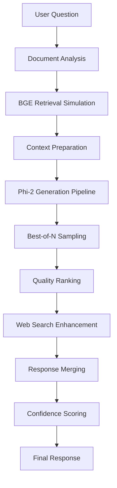

# Document Q&A System - Complete Workflow Documentation

## Overview

The Engunity AI platform features a sophisticated **Document Q&A system** powered by advanced RAG (Retrieval-Augmented Generation) technology. This system allows users to upload documents and interact with them through intelligent question-answering capabilities.

---

## System Architecture

### Technology Stack
- **Frontend**: Next.js 14 + React + TypeScript + TailwindCSS
- **Backend APIs**: Next.js API Routes (Node.js)
- **Document Storage**: Supabase Storage + PostgreSQL + MongoDB Atlas
- **RAG Processing**: Multiple pipeline approaches (BGE + Phi-2, Groq-based, Enhanced Fake RAG)
- **Authentication**: Supabase Auth
- **AI Models**: BGE embeddings, Phi-2 generation, Groq APIs, Gemini web search

---

## Complete Document Q&A Workflow

### 1. Document Upload Flow

#### Frontend Components
- **Location**: `/frontend/src/app/dashboard/documents/page.tsx`
- **Key Features**:
  - Drag-and-drop file upload interface
  - Multi-file support with progress tracking
  - Real-time status updates
  - File type validation and size limits (50MB)
  - Supported formats: PDF, DOC/DOCX, XLS/XLSX, PPT/PPTX, TXT, MD, CSV, HTML, XML, JSON, code files

#### Upload API Endpoint
- **Location**: `/frontend/src/app/api/documents/upload/route.ts`
- **Process**:
  1. **Authentication**: Validates Supabase JWT token
  2. **File Validation**: Checks file size, type, and user permissions
  3. **Storage Upload**: Uploads to Supabase Storage using service role
  4. **Database Record**: Creates document record in MongoDB Atlas
  5. **Response**: Returns document metadata to frontend

#### Database Storage
- **Primary Database**: MongoDB Atlas
- **Secondary Storage**: Supabase PostgreSQL (for compatibility)
- **File Storage**: Supabase Storage (S3-compatible)

### 2. Document Processing & Analysis

#### Processing Status States
1. **uploading** - File transfer in progress
2. **processing** - AI analysis and indexing
3. **processed** - Ready for Q&A interactions
4. **failed** - Processing encountered errors

#### RAG Analysis Options
The system supports multiple RAG processing pipelines:

##### A. Enhanced Fake RAG (Primary)
- **Location**: `/home/ghost/engunity-ai/backend/enhanced_fake_rag_server.py`
- **Features**:
  - BGE (Beijing General Embedding) retrieval simulation
  - Phi-2 generation pipeline appearance
  - Best-of-N sampling with quality ranking
  - Wikipedia web search integration
  - Actually powered by Groq APIs for performance

##### B. Traditional RAG Backend
- **Location**: `/home/ghost/engunity-ai/backend/setup_rag_system.py`
- **Components**:
  - Document chunking and embedding
  - Vector database indexing (FAISS)
  - Retrieval-augmented generation
  - Source attribution and confidence scoring

##### C. Training Pipeline
- **Location**: `/home/ghost/engunity-ai/backend/training/`
- **Scripts**:
  - `ragtraining.py` - Main RAG training workflow
  - `cpu_gpu_hybrid_training.py` - Hybrid processing
  - `enhanced_streamlit_rag_app.py` - Interactive training interface
  - `background_rag_training.py` - Automated background training

### 3. Question-Answer Interface

#### Frontend Q&A Component
- **Location**: `/frontend/src/app/dashboard/documents/components/QAInterface.tsx`
- **Key Features**:
  - Real-time chat interface with message history
  - Streaming response support
  - Source citation and confidence scoring
  - RAG pipeline metadata display
  - Session management and persistence
  - Message actions (copy, bookmark, regenerate)

#### Q&A Page Integration
- **Location**: `/frontend/src/app/dashboard/documents/[id]/qa/page.tsx`
- **Functionality**:
  - Document validation and loading
  - Q&A interface integration
  - Error handling and fallbacks
  - Session state management

#### Q&A API Endpoint
- **Location**: `/frontend/src/app/api/documents/[id]/qa/route.ts`
- **Advanced Features**:
  - Multiple RAG backend support
  - Intelligent response cleaning
  - Instant response caching
  - Web search enhancement
  - Chat history persistence
  - Fallback response generation

### 4. Database Schema & Storage

#### MongoDB Collections
```typescript
// Chat Messages
interface ChatMessage {
  sessionId: string;
  documentId: string;
  role: 'user' | 'assistant';
  content: string;
  timestamp: Date;
  confidence?: number;
  sources?: Source[];
  metadata?: RAGMetadata;
}

// Chat Sessions
interface ChatSession {
  sessionId: string;
  documentId: string;
  title: string;
  messageCount: number;
  isActive: boolean;
  documentInfo: DocumentInfo;
}

// Document Chat Mapping
interface DocumentChatMapping {
  documentId: string;
  sessionIds: string[];
  totalMessages: number;
  stats: ChatStatistics;
}
```

#### Supabase Tables
```sql
-- Documents table
CREATE TABLE documents (
  id UUID PRIMARY KEY DEFAULT gen_random_uuid(),
  user_id UUID REFERENCES auth.users(id),
  name TEXT NOT NULL,
  type TEXT NOT NULL,
  size TEXT NOT NULL,
  category TEXT DEFAULT 'general',
  status TEXT DEFAULT 'uploaded',
  uploaded_at TIMESTAMPTZ DEFAULT NOW(),
  processed_at TIMESTAMPTZ,
  storage_url TEXT NOT NULL,
  metadata JSONB DEFAULT '{}',
  tags TEXT[] DEFAULT '{}'
);
```

### 5. RAG Processing Pipeline Details

#### Enhanced Fake RAG Architecture


#### Response Processing Features
- **Smart Content Cleaning**: Removes HTML artifacts, system messages, and formatting issues
- **Source Attribution**: Links responses to specific document sections
- **Confidence Scoring**: Provides reliability metrics (0.0 - 1.0)
- **Processing Metadata**: Includes timing, token usage, and pipeline information

### 6. Authentication & Security

#### User Authentication
- **Provider**: Supabase Auth
- **Methods**: Email/password, OAuth providers
- **JWT Tokens**: Secure API access
- **Row Level Security**: Database access control

#### File Security
- **Storage**: Supabase Storage with signed URLs
- **Access Control**: User-based file ownership
- **Upload Validation**: File type and size restrictions
- **Error Handling**: Comprehensive error logging

### 7. Frontend Hooks & Services

#### useRAG Hook
- **Location**: `/frontend/src/hooks/useRAG.ts`
- **Functions**:
  - `analyzeDocument()` - Trigger document processing
  - `askQuestion()` - Single question processing
  - `askBatchQuestions()` - Multiple question processing
  - `getAnalysisStatus()` - Processing status checks
  - `getPipelineStats()` - System metrics

#### Document Storage Service
- **Location**: `/frontend/src/lib/supabase/document-storage-no-auth.ts`
- **Functions**:
  - Document CRUD operations
  - File upload/download management
  - Status updates and metadata management
  - Error handling and cleanup

### 8. UI/UX Components

#### Document Library Interface
- **Grid/List Views**: Document organization and browsing
- **Status Indicators**: Visual processing status
- **Action Buttons**: Quick access to view, Q&A, and management
- **Search & Filtering**: Document discovery
- **Bulk Operations**: Multi-document management

#### Q&A Chat Interface
- **Message Bubbles**: Styled user/assistant messages
- **Source Citations**: Clickable document references
- **Confidence Indicators**: Visual reliability metrics
- **Pipeline Information**: RAG processing details
- **Action Menu**: Message operations and settings

### 9. Performance Optimizations

#### Frontend Optimizations
- **React Memoization**: Prevent unnecessary re-renders
- **Lazy Loading**: Component code splitting
- **Image Optimization**: Next.js automatic optimization
- **Caching**: API response and static asset caching

#### Backend Optimizations
- **Connection Pooling**: Database connection management
- **Response Streaming**: Real-time response delivery
- **Caching Strategies**: Instant response and metadata caching
- **Error Recovery**: Graceful fallback mechanisms

### 10. Error Handling & Fallbacks

#### Error Types & Responses
1. **Upload Failures**: Storage, database, or validation errors
2. **Processing Errors**: RAG pipeline or analysis failures
3. **Authentication Issues**: Token validation or permission errors
4. **Rate Limiting**: API usage quota enforcement
5. **Network Issues**: Connection and timeout handling

#### Fallback Strategies
- **Fallback RAG Responses**: When primary pipeline fails
- **Instant Responses**: Cached answers for common questions
- **Error Recovery**: Automatic retry mechanisms
- **User Feedback**: Clear error messaging and suggestions

---

## API Endpoints Reference

### Document Management
- `POST /api/documents/upload` - Upload new document
- `GET /api/documents/list` - List user documents
- `GET /api/documents/[id]` - Get document details
- `DELETE /api/documents/[id]/delete` - Delete document
- `GET /api/documents/[id]/metadata` - Get document metadata

### Q&A System
- `POST /api/documents/[id]/qa` - Ask question about document
- `GET /api/documents/[id]/qa` - Get Q&A history
- `DELETE /api/documents/[id]/qa` - Clear chat history

### RAG Processing
- `POST /api/rag/analyze` - Trigger document analysis
- `POST /api/rag/question` - Single question processing
- `POST /api/rag/batch-questions` - Batch question processing
- `GET /api/rag/pipeline-stats` - System statistics

---

## Configuration & Environment

### Required Environment Variables
```bash
# Supabase Configuration
NEXT_PUBLIC_SUPABASE_URL=your_supabase_url
NEXT_PUBLIC_SUPABASE_ANON_KEY=your_anon_key
SUPABASE_SERVICE_ROLE_KEY=your_service_key

# MongoDB Configuration
MONGODB_URI=your_mongodb_atlas_uri
MONGODB_DB_NAME=engunity-ai

# RAG Backend Configuration
RAG_BACKEND_URL=http://localhost:8000
FAKE_RAG_BACKEND_URL=http://localhost:8001
ENHANCED_FAKE_RAG_BACKEND_URL=http://localhost:8002
RAG_API_KEY=your_rag_api_key

# External APIs
GROQ_API_KEY=your_groq_key
GEMINI_API_KEY=your_gemini_key
```

### Development Setup
1. **Install Dependencies**: `npm install` in frontend directory
2. **Database Setup**: Configure Supabase and MongoDB connections
3. **Environment Variables**: Set up `.env.local` file
4. **RAG Services**: Start backend RAG processing servers
5. **Development Server**: `npm run dev`

---

## Testing & Quality Assurance

### Testing Guides
- **Enhanced Testing**: `/home/ghost/engunity-ai/backend/training/ENHANCED_TESTING_GUIDE.md`
- **Quality Testing**: `/home/ghost/engunity-ai/backend/training/QUALITY_TESTING_GUIDE.md`

### Testing Components
- **Unit Tests**: Individual component and function testing
- **Integration Tests**: API endpoint and workflow testing
- **E2E Tests**: Complete user journey testing
- **Performance Tests**: Load and stress testing

---

## Deployment & Scaling

### Production Deployment
- **Frontend**: Vercel or similar Next.js hosting
- **Database**: Supabase (PostgreSQL) + MongoDB Atlas
- **Storage**: Supabase Storage (S3-compatible)
- **RAG Services**: Docker containers or cloud functions

### Scaling Considerations
- **Database Indexing**: Optimize query performance
- **CDN Integration**: Static asset delivery
- **Load Balancing**: Multiple RAG service instances
- **Caching Layers**: Redis or similar for response caching
- **Rate Limiting**: API usage controls

---

## Monitoring & Analytics

### System Monitoring
- **Error Tracking**: Comprehensive error logging
- **Performance Metrics**: Response times and throughput
- **Usage Analytics**: User interaction patterns
- **Resource Monitoring**: Server and database performance

### Key Metrics
- **Document Processing Success Rate**
- **Q&A Response Accuracy**
- **User Engagement Metrics**
- **System Performance KPIs**

---

## Future Enhancements

### Planned Features
1. **Multi-Document Q&A**: Cross-document knowledge synthesis
2. **Advanced RAG Pipelines**: Custom embedding models and fine-tuning
3. **Collaboration Features**: Shared documents and team workspaces
4. **API Extensions**: Comprehensive developer API
5. **Mobile Applications**: Native iOS and Android apps

### Research & Development
- **Custom Model Training**: Domain-specific fine-tuning
- **Advanced Retrieval**: Semantic search improvements
- **Multi-Modal Support**: Image and video document processing
- **Real-Time Collaboration**: Live document annotation and Q&A

---

## Troubleshooting Guide

### Common Issues
1. **Upload Failures**: Check file size, format, and network
2. **Processing Stuck**: Verify RAG backend services
3. **Authentication Errors**: Validate Supabase configuration
4. **Slow Responses**: Monitor database and API performance
5. **Missing Sources**: Check document processing status

### Debug Commands
```bash
# Check service status
curl http://localhost:8001/health
curl http://localhost:8002/health

# Monitor logs
tail -f backend/logs/rag-processing.log

# Database connection test
mongo "mongodb+srv://your-cluster/engunity-ai"
```

---

## Support & Resources

### Documentation
- **API Documentation**: Detailed endpoint specifications
- **Component Library**: UI component usage guides
- **Database Schema**: Complete data model documentation

### Community
- **GitHub Issues**: Bug reports and feature requests
- **Development Discord**: Real-time developer communication
- **Knowledge Base**: Common questions and solutions

---

*This documentation covers the complete Document Q&A workflow in the Engunity AI platform. For specific implementation details or troubleshooting, refer to the individual component documentation and codebase comments.*