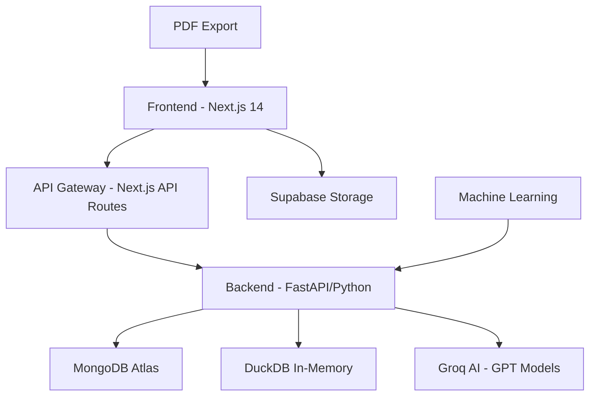

# Engunity AI - Data Analysis Module Documentation

## Overview

The Engunity AI Data Analysis Module is a comprehensive, full-stack data analytics platform that provides advanced data processing, visualization, and machine learning capabilities. Built with modern web technologies and AI-powered insights, it enables users to upload datasets, perform complex analyses, create visualizations, and generate predictive models.

## Architecture Overview



## Tech Stack

### Frontend
- **Framework**: Next.js 14 with App Router
- **UI**: React 18 with TypeScript
- **Styling**: Tailwind CSS
- **Animation**: Framer Motion
- **Charts**: Recharts Library
- **State Management**: React Hooks + Local Storage
- **PDF Generation**: jsPDF + html2canvas
- **Code Editor**: Monaco Editor

### Backend
- **API Framework**: FastAPI (Python)
- **Data Processing**: pandas, numpy
- **Database**: 
  - MongoDB Atlas (persistent storage)
  - DuckDB (in-memory SQL queries)
- **AI/ML**: 
  - Groq API (GPT-OSS-120B model)
  - scikit-learn (machine learning)
- **Authentication**: Supabase Auth integration

### Database Schema
- **MongoDB Collections**:
  - `analysis_sessions` - Complete analysis workspace state
  - `datasets_metadata` - Dataset information and statistics
- **Supabase Tables**:
  - User management and authentication
  - File storage metadata

## Core Components

### 1. Frontend Components

#### Main Analysis Workspace (`/frontend/src/app/dashboard/analysis/page.tsx`)
- **Size**: 2,000+ lines of React/TypeScript code
- **Functionality**:
  - File upload and management
  - Interactive data tables with pagination
  - Real-time chart builder
  - SQL and Natural Language Query interface
  - AI insights generation
  - Machine learning model training
  - Session save/load functionality
  - Export capabilities

**Key Features**:
- Dynamic SQL template generation based on dataset columns
- Fallback NLQ (Natural Language Query) processing
- Real-time chart creation with 8 chart types
- Advanced filtering and data transformation
- AI-powered anomaly detection

#### Export Preview System (`/frontend/src/app/dashboard/analysis/export-preview/`)
- **Professional PDF Generation** (`professional-pdf.tsx`):
  - AI-generated chart descriptions using Groq GPT models
  - Chart image capture using html2canvas
  - Advanced PDF layout with tables and visualizations
- **Simple PDF Export** (`simple-pdf.tsx`):
  - Basic tabular reports
  - Lightweight export option

#### Database Service Layer (`/frontend/src/lib/services/analysis-service.ts`)
- Analysis session CRUD operations
- MongoDB integration through API proxy
- Session state management
- Error handling and retry logic

### 2. Backend Implementation

#### Main API Server (`/backend/main.py`)
- **Core Features**:
  - FastAPI application with CORS middleware
  - Multi-database connectivity (MongoDB + DuckDB)
  - File upload and processing pipeline
  - Advanced SQL query generation with fallback patterns
  - AI-powered data insights
  - Machine learning model training endpoints

**Key Functions**:
```python
# Advanced SQL generation with 11+ pattern types
def generate_fallback_sql(question: str, df):
    # Handles department queries, aggregations, filtering, etc.

# AI data analysis
def get_ai_insights(df, groq_client):
    # Generates business insights using Groq AI

# ML model training
def train_prediction_model(df, target_column, model_type):
    # Trains classification/regression models
```

#### Analysis Session Management (`/backend/routes/analysis_sessions.py`)
- RESTful API for session CRUD operations
- MongoDB integration with proper error handling
- User authentication and authorization
- Session archiving and restoration

#### Data Models (`/backend/models/analysis_session.py`)
- Pydantic models for data validation
- Comprehensive schema definitions
- Type safety for API operations

### 3. Database Integration

#### MongoDB Schema (`analysis_sessions` collection)
```javascript
{
  _id: ObjectId,
  user_id: String,
  title: String,
  dataset_id: String,
  file_info: {
    name: String,
    size: String,
    rows: Number,
    columns: Number,
    uploadDate: String
  },
  data_summary: Object,
  column_metadata: Array,
  charts_data: Object,
  correlation_data: Object,
  query_history: Array,
  ai_insights: Array,
  custom_charts: Array,
  prediction_results: Array,
  created_at: Date,
  updated_at: Date
}
```

#### DuckDB Integration
- In-memory SQL processing for fast queries
- Dynamic table creation from uploaded datasets
- Advanced SQL query execution with error handling

## Algorithms and Techniques

### 1. Data Processing Algorithms

#### Statistical Analysis
- **Descriptive Statistics**: Mean, median, mode, standard deviation, quartiles
- **Correlation Analysis**: Pearson correlation matrices with significance testing
- **Outlier Detection**: IQR-based outlier identification
- **Data Quality Assessment**: Missing value analysis, data type inference

#### Query Processing
- **Pattern Matching**: 11 distinct SQL pattern types for NLQ conversion
- **Regex-based Parsing**: Department name extraction, numeric value identification
- **Fallback Mechanisms**: Multiple layers of query interpretation

### 2. Machine Learning Algorithms

#### Supervised Learning
- **Classification**: 
  - Random Forest Classifier
  - Logistic Regression
  - Support Vector Machines
- **Regression**:
  - Linear Regression
  - Random Forest Regressor
  - Gradient Boosting

#### Feature Engineering
- Automatic feature selection
- Categorical encoding (Label Encoding, One-Hot Encoding)
- Missing value imputation
- Feature importance calculation

### 3. AI-Powered Insights

#### Natural Language Processing
- **Model**: Groq GPT-OSS-120B (120 billion parameters)
- **Fallback**: Mixtral-8x7b-32768
- **Use Cases**:
  - Chart description generation
  - Business insight extraction
  - Anomaly explanation
  - Trend analysis

#### Prompt Engineering
```python
prompt = f"""
Analyze this dataset with {df.shape[0]} rows and {df.shape[1]} columns.

Column Information:
{column_info}

Statistical Summary:
{summary_stats}

Provide insights on:
1. Key patterns and trends
2. Business implications
3. Data quality issues
4. Recommendations for further analysis
"""
```

### 4. Visualization Algorithms

#### Chart Generation
- **Dynamic Chart Selection**: Algorithm chooses optimal chart type based on data types
- **Color Palette Generation**: Automated color scheme selection
- **Layout Optimization**: Responsive chart sizing and positioning

#### Data Aggregation
- **Grouping Algorithms**: Intelligent data grouping for visualizations
- **Binning Strategies**: Automatic histogram binning
- **Sampling Techniques**: Large dataset visualization optimization

## Component Workflow

### 1. Data Upload and Processing Flow

```
1. File Upload (Frontend)
   “
2. File Validation and Parsing (Backend)
   “
3. Data Quality Assessment (pandas/numpy)
   “
4. DuckDB Table Creation (In-Memory)
   “
5. Column Metadata Generation
   “
6. Statistical Summary Calculation
   “
7. MongoDB Session Creation
   “
8. Frontend State Update
```

### 2. Query Execution Workflow

```
1. User Input (SQL/NLQ)
   “
2. Query Type Detection
   “
3. SQL Generation (if NLQ)
   “
4. DuckDB Query Execution
   “
5. Result Processing
   “
6. Chart Generation (if applicable)
   “
7. Session State Update
```

### 3. Machine Learning Pipeline

```
1. Target Column Selection
   “
2. Feature Engineering
   “
3. Data Preprocessing
   “
4. Model Training (scikit-learn)
   “
5. Cross-Validation
   “
6. Performance Evaluation
   “
7. Feature Importance Analysis
   “
8. Results Storage
```

### 4. AI Insights Generation

```
1. Data Analysis Trigger
   “
2. Statistical Computation
   “
3. Prompt Construction
   “
4. Groq API Call (GPT-OSS-120B)
   “
5. Response Processing
   “
6. Insight Categorization
   “
7. Frontend Display
```

## Advanced Features

### 1. Session Management
- **Auto-save**: Automatic session state persistence
- **Version Control**: Session history tracking
- **Collaborative Features**: Multi-user session sharing
- **Export/Import**: Session data portability

### 2. Query Intelligence
- **Dynamic Templates**: SQL template generation based on dataset schema
- **Pattern Recognition**: 11+ query pattern types
- **Context Awareness**: Previous query context consideration
- **Error Recovery**: Robust error handling with fallbacks

### 3. Visualization Engine
- **Chart Types**: Bar, Line, Pie, Scatter, Area, Donut, Column, Heatmap
- **Interactive Features**: Zoom, pan, hover tooltips
- **Export Capabilities**: PNG, SVG, PDF export
- **Responsive Design**: Mobile-optimized charts

### 4. AI Integration
- **Multi-Model Support**: Primary and fallback AI models
- **Contextual Analysis**: Dataset-aware AI prompting
- **Business Intelligence**: Domain-specific insights
- **Confidence Scoring**: AI prediction confidence levels

## Performance Optimizations

### Frontend Optimizations
- **Code Splitting**: Route-based code splitting with Next.js
- **Lazy Loading**: Component lazy loading for large datasets
- **Virtual Scrolling**: Efficient large table rendering
- **Memoization**: React.memo and useMemo for expensive operations

### Backend Optimizations
- **Connection Pooling**: MongoDB connection pooling
- **Query Caching**: DuckDB query result caching
- **Async Processing**: Background task processing
- **Memory Management**: Efficient pandas DataFrame handling

### Database Optimizations
- **Indexing**: MongoDB compound indexes on frequently queried fields
- **Aggregation Pipelines**: Optimized MongoDB aggregation queries
- **In-Memory Processing**: DuckDB for fast analytical queries

## Security Considerations

### Data Security
- **Input Validation**: Comprehensive Pydantic model validation
- **SQL Injection Prevention**: Parameterized queries and input sanitization
- **File Upload Security**: File type validation and size limits
- **Session Isolation**: User-specific data isolation

### Authentication & Authorization
- **JWT Tokens**: Supabase-based authentication
- **Role-Based Access**: User role and permission management
- **API Security**: CORS configuration and rate limiting
- **Data Privacy**: User data anonymization options

## Deployment Architecture

### Production Setup
- **Frontend**: Vercel deployment with Edge Runtime
- **Backend**: Docker containerization with auto-scaling
- **Database**: MongoDB Atlas cluster with replica sets
- **File Storage**: Supabase Storage with CDN
- **Monitoring**: Application performance monitoring

### Development Environment
- **Local Development**: Docker Compose setup
- **Hot Reloading**: Next.js development server
- **Database**: Local MongoDB with test data
- **API Testing**: FastAPI automatic documentation

## API Endpoints

### Analysis Sessions
- `POST /api/analysis-sessions` - Create new session
- `GET /api/analysis-sessions` - List user sessions
- `GET /api/analysis-sessions/{id}` - Get specific session
- `PATCH /api/analysis-sessions/{id}` - Update session
- `DELETE /api/analysis-sessions/{id}` - Delete session

### Data Processing
- `POST /api/upload` - Upload and process dataset
- `POST /api/query` - Execute SQL/NLQ query
- `POST /api/predict` - Train machine learning model
- `GET /api/insights/{dataset_id}` - Get AI insights

### Visualizations
- `POST /api/charts` - Generate chart data
- `GET /api/charts/{chart_id}` - Get chart configuration
- `POST /api/export/pdf` - Generate PDF report

## Future Enhancements

### Planned Features
1. **Real-time Collaboration**: Multi-user real-time editing
2. **Advanced ML Models**: Deep learning integration
3. **Data Pipeline Builder**: Visual ETL pipeline creation
4. **Custom Dashboards**: Drag-and-drop dashboard builder
5. **API Integration**: External data source connectors
6. **Advanced Security**: End-to-end encryption
7. **Mobile App**: Native mobile application
8. **Voice Commands**: Voice-activated data queries

### Technical Improvements
1. **Performance**: Query optimization and caching
2. **Scalability**: Microservices architecture
3. **Monitoring**: Advanced analytics and logging
4. **Testing**: Comprehensive test coverage
5. **Documentation**: Interactive API documentation

## File Structure

```
/frontend/src/app/dashboard/analysis/
 page.tsx                    # Main analysis workspace (2000+ lines)
 upload/page.tsx            # File upload interface
 [datasetId]/page.tsx       # Dataset-specific analysis
 export-preview/
     page.tsx               # Export preview interface
     simple-pdf.tsx         # Basic PDF export
     professional-pdf.tsx   # Advanced PDF with AI
     chart-capture-utils.tsx # Chart image capture

/frontend/src/lib/services/
 analysis-service.ts        # Database service layer (500+ lines)

/frontend/src/types/
 database.ts               # TypeScript type definitions (900+ lines)

/backend/
 main.py                   # FastAPI main server (2000+ lines)
 models/analysis_session.py # Pydantic models (200+ lines)
 routes/analysis_sessions.py # API routes (400+ lines)
```

## Conclusion

The Engunity AI Data Analysis Module represents a comprehensive, enterprise-grade analytics platform that combines modern web technologies with advanced AI capabilities. The system provides seamless data processing, intelligent query generation, machine learning integration, and professional reporting capabilities, making it suitable for both technical and non-technical users.

The modular architecture ensures scalability and maintainability, while the extensive use of TypeScript and Pydantic models provides type safety throughout the application. The integration of multiple AI models and fallback mechanisms ensures robust performance and user experience.

---

*Last Updated: August 29, 2025*  
*Version: 1.0.0*  
*Authors: Engunity AI Development Team*